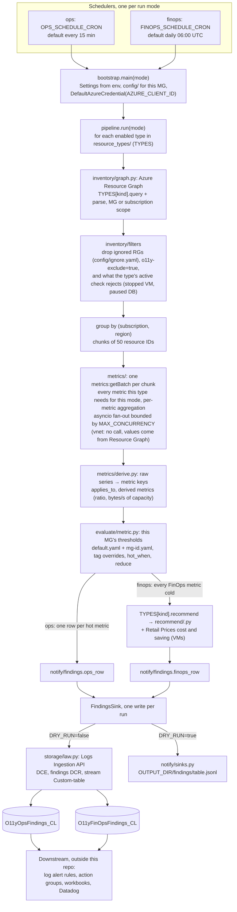
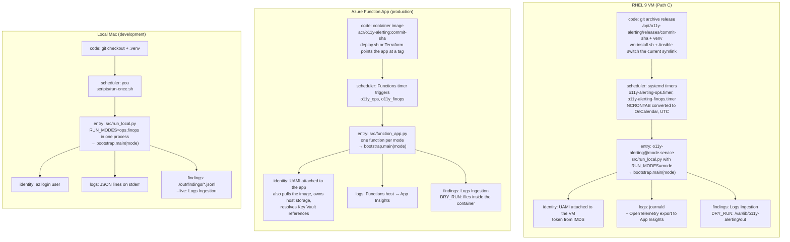
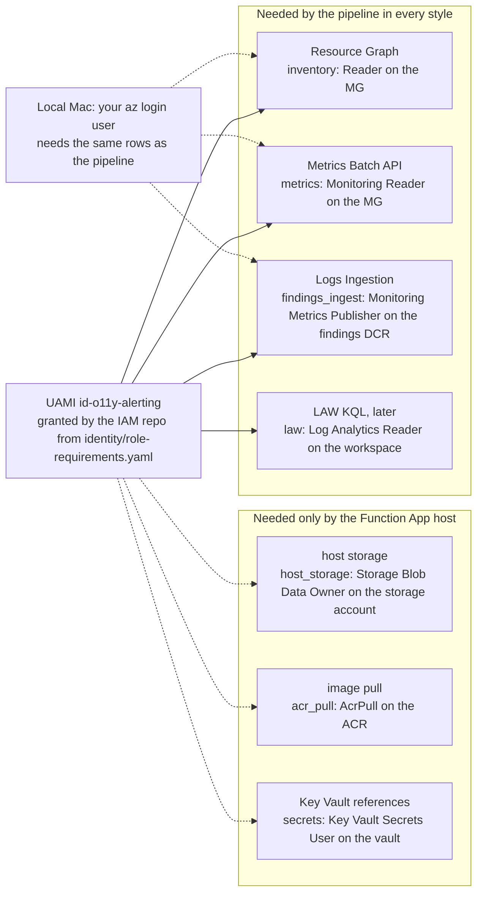

# Architecture

Read this before changing the pipeline, adding a client, or questioning a design choice.

## Why this exists

Diagnostic Settings are not shipped at scale, and there is no central metric store across
subscriptions. This function fills that gap by querying each resource's built-in platform metrics
directly. Customers: the Ops team, the FinOps team, and the app teams that own resources (routed by tag).

**Why not Azure Advisor?** It was rejected on purpose. It is too generic, it has no Event Hub or VNET
coverage, it has no routing by ownership, and it gives no control over thresholds.

## Pipeline

One run is one mode. The two schedulers start the same `bootstrap.main(mode)`; the mode picks the metric
window, the evaluator side, and the table. Inside a run the pipeline loops over the enabled resource
types (`resource_types:` in the thresholds config, narrowed by `RESOURCE_TYPES`); every type goes through
the same stages, and the rows of all types are written in one call at the end.



The order of calls in one run, and where it can stop:

```mermaid
sequenceDiagram
  participant S as Scheduler
  participant P as pipeline.run
  participant RG as Resource Graph
  participant M as Metrics Batch API
  participant RP as Retail Prices
  participant LI as Logs Ingestion (DCE + DCR)
  S->>P: main(mode)
  loop each enabled resource type (a failing type is counted and the run continues)
    P->>RG: list_resources(kind, scope) with scope = MG_ID, or SUBSCRIPTION_IDS when set
    RG-->>P: resources with type, region, SKU, tags, type facts (403: PermissionMissing inventory)
    P->>P: filter ignored RGs, excluded tags, inactive resources; group by (sub, region), chunk by 50
    par one task per chunk, at most MAX_CONCURRENCY in flight
      P->>M: query(region, sub, ids, namespace, [metric names + aggregations], window for this mode)
      M-->>P: series per resource id and metric (a failed chunk skips its resources with chunk_failed)
    end
    P->>P: resolve_series (applies_to, derived), then evaluate_hot per metric or evaluate_cold per resource
    opt finops, priced types (VM)
      P->>RP: monthly_price(region, current SKU) and monthly_price(region, target SKU)
      RP-->>P: prices, or None (pricing never fails the run)
    end
  end
  P->>LI: upload rows of every type to Custom-table, once per run
  LI-->>P: ok, or 403 as PermissionMissing findings_ingest, or FindingsWriteFailed
  P-->>S: run complete log line + RunSummary
```

## Metrics: batch, never per resource

Use the Metrics Batch API
(`https://{region}.metrics.monitor.azure.com/subscriptions/{subId}/metrics:getBatch`) through
`azure-monitor-querymetrics` `MetricsClient.query_resources()`. `azure-monitor-query` 2.x has no
metrics client (see `docs/gotchas.md`).

- One call covers one resource type, one region, and one subscription, with up to **50 resource IDs**,
  and carries **every metric name** the type needs for the run mode with the union of their aggregations
  (`Average`, `Maximum`, `Total`); each metric picks its own aggregation out of the response.
- Resource Graph supplies the inventory (type, region, SKU, tags, and the type facts that decide which
  metrics apply, e.g. a SQL database's purchasing model), so batches are built without per-subscription
  ARM listing.
- Some metrics are derived from two raw ones (`metrics/derive.py`): SQL MI storage % from
  `storage_space_used_mb / reserved_storage_mb`, Event Hubs ingress % from `IncomingBytes` against the
  namespace's throughput-unit capacity.
- VM memory is the platform metric `Available Memory Percentage` (inverted: low is hot); guest-OS
  metrics via AMA/DCR → LAW are collected elsewhere and are **not** read by this function.
- VNET utilization comes from Resource Graph arithmetic only, with no Monitor calls.
- Minimum grains differ per metric (Cosmos DB throughput metrics: PT5M); a type can override the window
  granularity (`granularity:` in its config block).

## Scale

Expect 30–50 subscriptions per MG. One function instance handles a full MG in a single run, fanning out
per subscription with `asyncio` plus a semaphore. The last-resort fallback is one function per
subscription. Scope is switchable through config (`MG_ID` vs `SUBSCRIPTION_IDS`), so that fallback needs
no code change.

## Resource types

All seven are implemented (`src/resource_types/`, config key in parentheses). Rules and thresholds:
[recommendations](recommendations.md), [thresholds](thresholds.md); row spellings: [findings](findings.md).

| # | Type | Ops signal (hot) | FinOps signal (cold) | Metric source |
|---|------|------------------|----------------------|---------------|
| 1 | Virtual Machines (`vm`) | `Percentage CPU`, `Available Memory Percentage` (low), OS-disk and uncached VM IOPS/bandwidth % | Low CPU and low peak memory use → smaller SKU in same family | Platform only. Guest-OS metrics (disk space, per-process) are collected by AMA/DCRs elsewhere, not here |
| 2 | Azure SQL Database (`sqldb`) / Elastic Pool (`sqlpool`) | DTU % or CPU % (by purchasing model), storage %, workers % | Low DTU/vCore → lower service objective / fewer vCores / smaller pool | Platform |
| 3 | Azure SQL Managed Instance (`sqlmi`) | CPU %, storage % (derived from used/reserved MB) | Low CPU → fewer vCores | Platform |
| 4 | PostgreSQL Flexible Server (`postgres`) | CPU, memory, storage %, disk IOPS % | Low CPU/memory → smaller compute SKU in family | Platform |
| 5 | Cosmos DB (`cosmos`) | `NormalizedRUConsumption` (max), throttled request % | Low normalized RU → lower provisioned RU/s, or autoscale | Platform (`ProvisionedThroughput` / `AutoscaleMaxThroughput` as recommender inputs; PT5M grain) |
| 6 | Event Hubs Namespace (`eventhub`) | `ThrottledRequests` (sum), CPU (Premium) | Low ingress bytes/s vs TU/PU capacity → fewer units | Platform (`IncomingBytes` Total vs capacity from `sku.capacity`) |
| 7 | Virtual Network subnets (`vnet`) | Subnet IP utilization ≥ threshold | none (capacity, not cost) | Resource Graph math: address space minus allocated IPs minus 5 Azure-reserved per subnet |

## Deployment styles

The same `src/`, `config/`, and `identity/` run in three places. Only the scheduler, the way the code
arrives, the identity, and where logs go differ. Operator runbooks: [docs/ops/](../ops/README.md).



| | Local Mac | Function App | RHEL 9 VM |
|---|---|---|---|
| Scheduler | you | Functions timers (`%OPS_SCHEDULE_CRON%`, `%FINOPS_SCHEDULE_CRON%`) | systemd timers rendered from the same NCRONTAB |
| Entry point | `src/run_local.py`, both modes in sequence | `src/function_app.py`, one timer function per mode | `src/run_local.py`, one service instance per mode |
| Code arrives as | git checkout | image tag in the ACR (CI or `build-image.sh`) | `git archive` release, own venv per release |
| Deploy tool | none | `scripts/deploy.sh` (dev) or `terraform/module-azure-o11y` (CI) | `scripts/vm-install.sh` + `ansible/` |
| Identity | `az login` user | UAMI attached to the app, `AZURE_CLIENT_ID` | UAMI attached to the VM, `AZURE_CLIENT_ID` |
| Settings | env / `.env` / `run-once.sh` flags | app settings | `/etc/o11y-alerting/o11y-alerting.env` |
| Findings, live | Logs Ingestion (`--live`) | Logs Ingestion | Logs Ingestion |
| Findings, dry run | `./out/findings/*.jsonl` | files inside the container | `/var/lib/o11y-alerting/out/findings/*.jsonl` |
| Logs | stderr | App Insights via the host | journald, plus App Insights via OpenTelemetry |
| Run now | run the script | `POST /admin/functions/<name>` with the master key | `systemctl start o11y-alerting@<mode>.service` |
| Time limit | none | `functionTimeout` 30 min | `TimeoutStartSec` 30 min |
| Missed runs | n/a | not caught up (`run_on_startup=False`) | not caught up (`Persistent=false`) |
| Overlap | n/a | timer singleton | a timer never starts its unit while it runs |
| Extra platform pieces | none | Elastic Premium plan, host storage account, ACR, Key Vault | `python3.11`, `o11y` user, hardened oneshot unit |

The identity requirements differ only by what the platform itself needs. The pipeline's own calls are
the same everywhere:



`findings_ingest` is scoped to the DCR that the deployment creates, so it is granted after the first
deploy in every style. The VM path skips `host_storage` and `acr_pull` and has no Key Vault today.

## Out of scope

- **History beyond the findings tables.** Runs keep no other state. Storage holds only Functions host
  state. Never add a database or another table; findings history is the
  LAW tables (ADR-0001).
- **Sending notifications.** Teams, email, and paging are built on the tables downstream.
- **Auto-remediation.** The system recommends; humans resize.
- **Azure Advisor and Cost Management integration.**

## Code boundaries

- Every Azure call goes through a thin client in `inventory/graph.py`, `metrics/batch.py`, or
  `storage/law.py` (Logs Ingestion), behind the Protocols in `src/ports.py` and `src/notify/base.py`.
  `resource_types/` (queries, parsers, type rules), `evaluate/`, `recommend/`, and `notify/` (findings row
  builders) are SDK-free and take plain data (`src/models.py`), so tests can swap the clients.
- Everything type-specific lives in one `ResourceTypeSpec` per type (`src/resource_types/<type>.py`);
  `pipeline.py`, the evaluators, and the row builders never branch on a type.
- The one exception is `recommend/pricing.py`, the `RetailPriceClient` for the unauthenticated Retail
  Prices API. It takes an injected `httpx.AsyncClient`, needs no identity, and never fails the run.
- Code makes no `azure-cli` calls.
- Logging is structured JSON to App Insights. Log every skipped resource with a reason.
